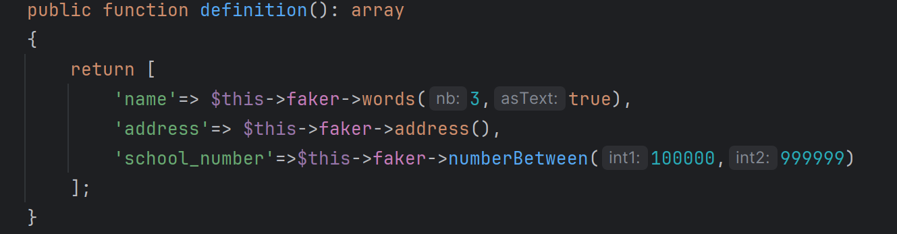
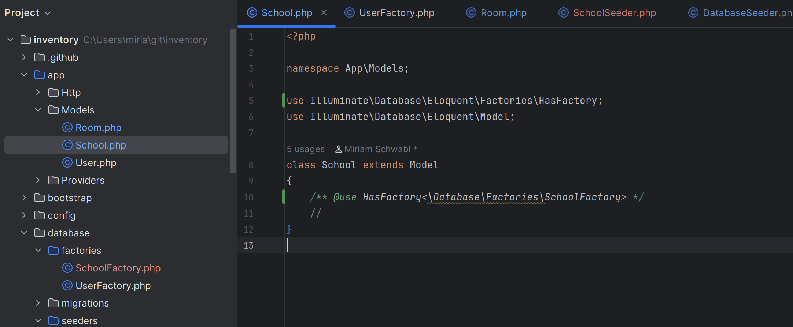

## Factory erstellen

Erstellt eine Factory:
```markdown 
php artisan make:factory SchoolFactory
```



:::Note
Um eine Factory benutzen zu können brauche ich ein using in dem dazugehörigen Model.
:::

