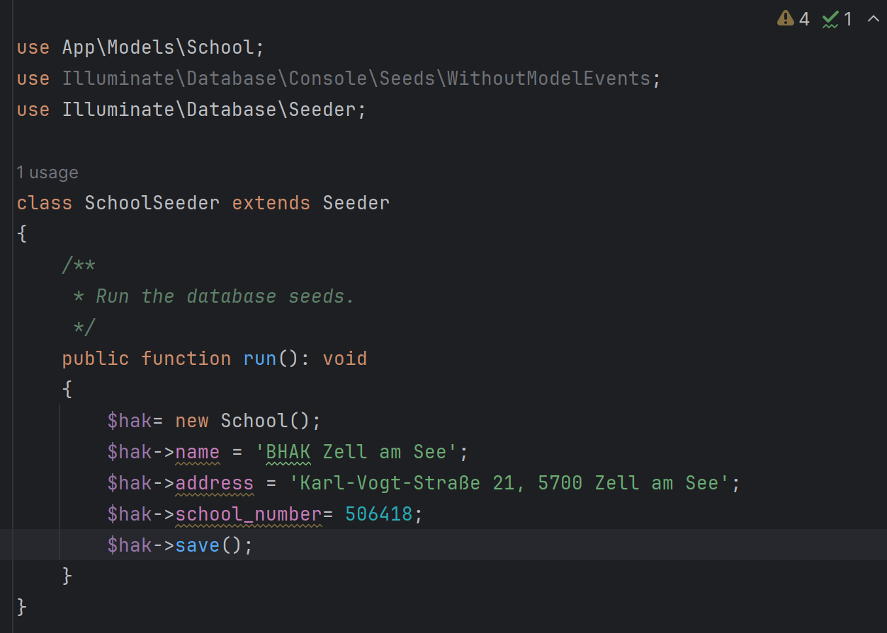
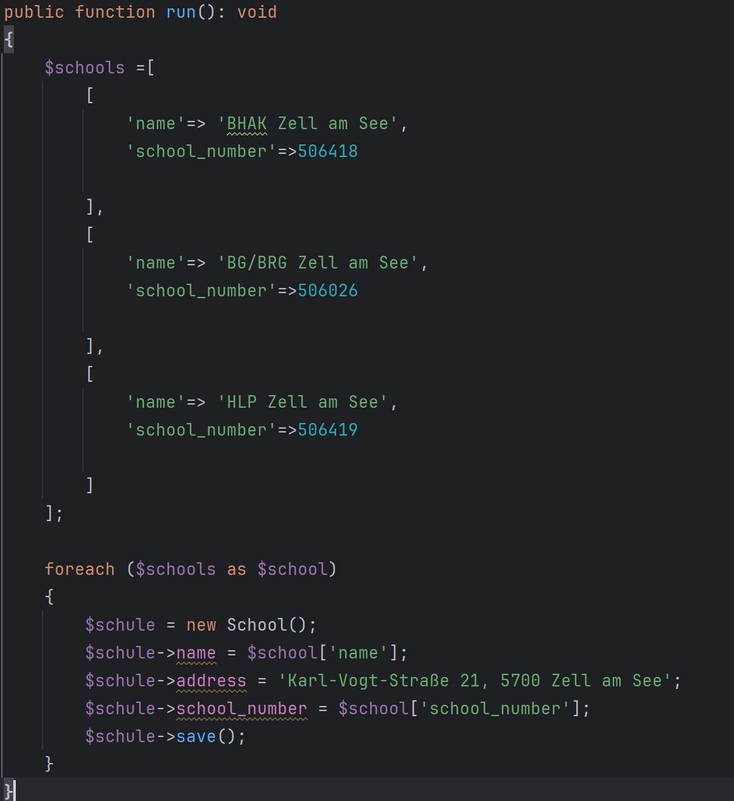
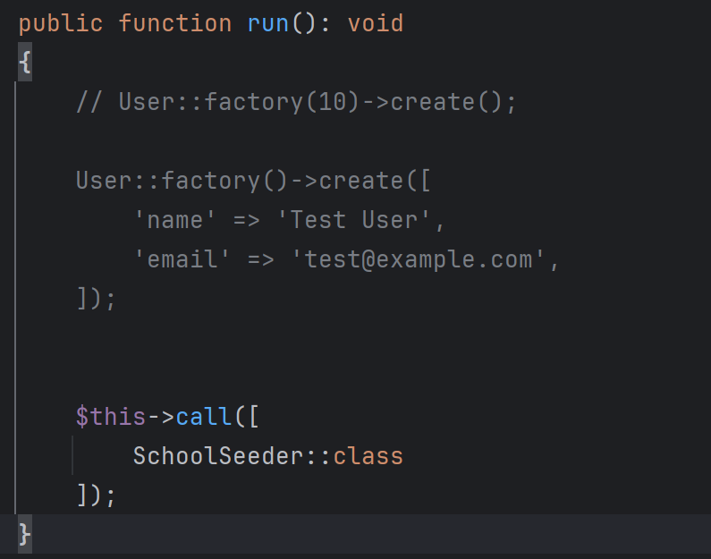

# Seeder erstellen

Macht eine Datenbank mit Demodaten
```markdown 
 php artisan make:seeder SchoolSeeder
```

:::Note 
Dannach eine Factory erstellen wenn ich demodaten bracuhe
:::





Migriert dannach neu um die Datenbank nur mit den Datenbanken zu erstellen
```markdown 
 php artisan migrate:fresh --seed
```